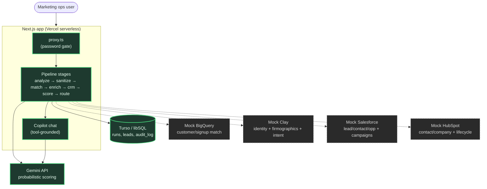

# RP Lead Pipeline POC

A marketing-ops proof-of-concept that ingests an inbound lead CSV, cleans it, matches it against
internal systems, enriches/scores it, and routes each lead to the right follow-up treatment
(sales, nurture, self-serve, suppression, or human review) — with a human-in-the-loop review
queue and a PII-safe audit trail throughout.

## Architecture

Solid nodes/arrows are real, live integrations. Dashed nodes/arrows are simulated — in-process
mock modules that return realistic, deterministic payloads shaped like the real APIs, but never
make an external network call.



## What's real vs. simulated

- **Real**: the Next.js app itself, the ingestion/sanitize pipeline, the deterministic ICP
  scoring engine, and the Gemini calls for probabilistic scoring (6.2) and the copilot chat (9.1).
- **Simulated**: Salesforce, HubSpot, BigQuery, and Clay. Each has a mock module
  (`src/lib/mocks/*.ts`) that returns realistic, deterministic payloads shaped like the real APIs,
  seeded from the input file so re-running the same CSV produces the same matches/scores every
  time. None of these call any real external service.

## Features

- **Full pipeline stepper**: analysis → sanitize → cohorts → enrichment → CRM/MAP → scoring →
  routing → logs → review, each with its own page and live status tracking.
- **Run All Stages**: one-click button that runs every remaining stage sequentially with
  automatic approvals, so you don't have to click through each step by hand.
- **Lead detail drill-down**: click any lead ID anywhere in the app to see its full record —
  identity & enrichment, campaign history, Intent Surge Details (Clay-derived), channel
  permissions, dual-engine (deterministic vs. LLM) score comparison, sales alert, recommended
  action, and audit trail. The back link returns you to whichever stage page you came from.
- **Sortable, filterable lead tables**: every stage page shows Email / Company / Title alongside
  its stage-specific columns, with tier/status/decision filter chips and click-to-sort headers.
- **Live-updating UI**: the stepper, sidebar progress, and scorecard poll for updates, so status
  changes (e.g. a background stage finishing) show up without a manual refresh.
- **Copilot chat panel**: answers questions about the current run's leads, scores, and history
  using tool calls grounded in that run's actual data (not hallucinated).
- **Settings page**: adjust the score-divergence threshold, and configure Slack webhook /
  email notifications for review-queue and daily-summary events.
- **Password gate**: the whole app sits behind a simple cookie-based password check
  (`src/proxy.ts`) since this is a shared demo deployment, not a production auth setup.

## Prerequisites

- Node.js 18+ and npm
- A Turso (libSQL) database — `TURSO_DATABASE_URL` and `TURSO_AUTH_TOKEN`
- A Gemini API key

Create `.env.local`:

```
GEMINI_API_KEY=...
GEMINI_MODEL=gemini-flash-lite-latest
SCORE_DIVERGENCE_THRESHOLD=30
TURSO_DATABASE_URL=...
TURSO_AUTH_TOKEN=...
```

`GEMINI_MODEL` and `SCORE_DIVERGENCE_THRESHOLD` are optional (defaults shown above).
`SCORE_DIVERGENCE_THRESHOLD` controls how far apart the deterministic tier and the LLM's
probabilistic score (both normalized to 0-100) can be before a lead is flagged for human
review (spec 6.3/6.4) — this is also editable at runtime from the Settings page.

## Running locally

```bash
npm install
npm run dev
```

Open [http://localhost:3000](http://localhost:3000), which redirects to `/runs`. Upload a lead CSV
from `/runs/new` — this automatically runs the anomaly analysis (stage 1.1/1.2). From there, either
click **Run All Stages** to execute the whole pipeline at once, or step through it manually:

1. **Analysis** → review anomalies, add optional cleaning instructions, approve sanitize
2. **Sanitize** → review the diff, download the cleaned CSV, proceed to matching
3. **Cohorts** → simulated BigQuery signup match, split into existing/new user cohorts
4. **Enrichment** → simulated Clay identity resolution + firmographics + intent scoring
5. **CRM/MAP** → simulated Salesforce + HubSpot lookup, EU consent hard-rule enforcement
6. **Scoring** → deterministic ICP tier + Gemini probabilistic score + divergence reconciliation
7. **Routing** → final routing decision per the ICP memo, EU/divergence/edge-case review gating
8. **Logs** → PII-free audit trail with drill-down to the full linked record

The **Review queue** (linked from the stepper) is where a human approves or rejects any lead
routed there, filterable by tier and status. The **copilot** panel (right sidebar on desktop,
slide-up drawer on mobile) answers questions about that run's leads, scores, and history. Any
lead ID is clickable from any stage page to open its full detail view.

## Tests

```bash
npm test
```

Runs unit tests for the deterministic ICP scoring engine (`src/lib/scoring/deterministic.ts`)
against real rows and edge cases from the inbound leads CSV.

## Data layout

- `src/lib/pipeline/` — analyze/sanitize logic (TypeScript), run in-process rather than shelling
  out, so it works on Vercel's serverless runtime.
- `src/lib/stages/` — one module per pipeline stage (analyze, sanitize, match, enrich, crm,
  score, route), each updating run/lead state and writing to the audit log.
- `src/lib/mocks/` — simulated Salesforce, HubSpot, BigQuery, and Clay modules.
- `src/lib/db.ts` — Turso/libSQL client. Schema is applied idempotently on first use.
- `data/runs/<runId>/` — per-run artifacts (raw upload, reports, mock payloads), stored via the
  configured Blob/storage provider.

## Deployment

Deployed on Vercel. The database is Turso (libSQL) rather than a local SQLite file, and the
analyze/sanitize logic runs as plain TypeScript in the request handler rather than shelling out to
a subprocess, so the whole app runs on Vercel's standard Node.js serverless functions with no
native addons or external processes required.
