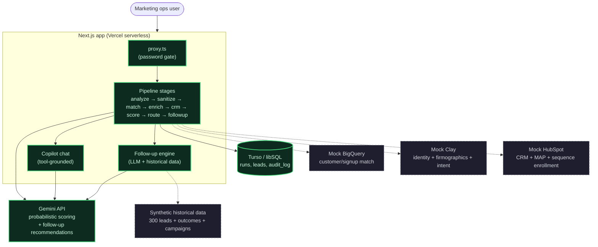

# RP Lead Pipeline — v2

A marketing-ops proof-of-concept that ingests an inbound lead CSV, cleans it, matches it against
internal systems, enriches/scores it, routes each lead to the right follow-up treatment, and —
new in v2 — uses an LLM grounded in historical campaign data to generate specific, executable
follow-up actions for every routed lead.

## Architecture

Solid nodes/arrows are real, live integrations. Dashed nodes/arrows are simulated — in-process
mock modules that return realistic, deterministic payloads shaped like the real APIs, but never
make an external network call.



## What's real vs. simulated

- **Real**: the Next.js app, the ingestion/sanitize pipeline, the deterministic ICP scoring engine,
  Gemini calls for probabilistic scoring (6.2), the copilot (9.1), and the follow-up recommendation
  engine (v2) — all make real LLM API calls.
- **Simulated**: HubSpot, BigQuery, and Clay. Each has a mock module (`src/lib/mocks/*.ts`) that
  returns realistic, deterministic payloads shaped like the real APIs, seeded from the input file so
  re-running the same CSV produces the same matches/scores every time.
- **v2 change**: Salesforce removed. HubSpot is now the single source of truth for both CRM and
  marketing automation. The HubSpot mock was expanded to cover campaign history, deals, email
  engagement, and lead score — previously split between the Salesforce and HubSpot mocks.

## Features

- **Full pipeline stepper**: analysis → sanitize → cohorts → enrichment → CRM/MAP → scoring →
  routing → follow-up → logs → review, each with its own page and live status tracking.
- **Run All Stages**: one-click button that runs every remaining stage sequentially with automatic
  approvals.
- **Lead detail drill-down**: click any lead ID to see its full record — identity, enrichment,
  campaign history, dual-engine score comparison, routing decision, and audit trail. Back link
  returns to whichever stage page you came from.
- **Sortable, filterable lead tables**: every stage page shows Email / Company / Title alongside
  stage-specific columns, with tier/status/decision filter chips and click-to-sort headers.
- **Live-updating UI**: the stepper, sidebar progress, and scorecard poll for updates automatically.
- **Follow-up recommendations** *(v2)*: for every lead routed to sales, nurture, or human review,
  Gemini generates 2-4 specific recommendations grounded in the lead's actual signals and in
  historical data from similar leads who converted. Each recommendation can be executed in HubSpot
  with one click (create task, enroll in sequence, create deal, send email, schedule meeting).
- **Copilot chat panel**: answers questions about the current run's leads, scores, and history
  using tool calls grounded in that run's actual data.
- **Settings page**: adjust the score-divergence threshold, and configure Slack webhook /
  email notifications.
- **Password gate**: the whole app sits behind a simple cookie-based password check (`src/proxy.ts`).

## Prerequisites

- Node.js 18+ and npm
- A Turso (libSQL) database — `TURSO_DATABASE_URL` and `TURSO_AUTH_TOKEN`
- A Gemini API key

Create `.env.local`:

```
GEMINI_API_KEY=...
TURSO_DATABASE_URL=...
TURSO_AUTH_TOKEN=...

# Optional
GEMINI_MODEL=gemini-flash-lite-latest
SCORE_DIVERGENCE_THRESHOLD=30
APP_PASSWORD=yourpassword
```

## Running locally

```bash
npm install
npm run dev
```

Open [http://localhost:3000](http://localhost:3000). If upgrading from v1, run the DB migration first:

```bash
TURSO_DATABASE_URL=... TURSO_AUTH_TOKEN=... npx tsx scripts/migrate.ts
```

## Pipeline walkthrough

1. **Analysis** → review anomalies, add optional cleaning instructions, approve sanitize
2. **Sanitize** → review the diff, download the cleaned CSV, proceed to matching
3. **Cohorts** → simulated BigQuery signup match, split into existing/new user cohorts
4. **Enrichment** → simulated Clay identity resolution + firmographics + intent scoring
5. **CRM/MAP** → simulated HubSpot lookup, EU consent hard-rule enforcement (GDPR)
6. **Scoring** → deterministic ICP tier + Gemini probabilistic score + divergence reconciliation
7. **Routing** → final routing decision per the ICP memo (sales/nurture/self-serve/suppress/review)
8. **Follow-up** *(v2)* → LLM generates personalised, executable follow-up recommendations for
   sales reps and marketers, grounded in historical conversion data
9. **Logs** → PII-free audit trail with drill-down to the full linked record

The **Review queue** (linked from the stepper) is where a human approves or rejects flagged leads,
filterable by tier and status. The **copilot** panel answers questions about leads, scores, and
history.

## Tests

```bash
npm test
```

Unit tests for the deterministic ICP scoring engine against real rows and edge cases.

## Data layout

- `src/lib/pipeline/` — analyze/sanitize logic (TypeScript), runs in-process
- `src/lib/stages/` — one module per pipeline stage (analyze, sanitize, match, enrich, crm, score,
  route, followup), each updating run/lead state and writing to the audit log
- `src/lib/mocks/` — HubSpot, BigQuery, Clay mocks; historical synthetic dataset; HubSpot action
  executor
- `src/lib/db.ts` — Turso/libSQL client
- `db/schema.sql` — checked-in DDL (idempotent `CREATE TABLE IF NOT EXISTS` everywhere)
- `scripts/migrate.ts` — v2 migration (adds `followup_json`, `followup_executed_json` columns)

## Deployment

Deploys to Vercel. Full deployment instructions: see [USER_MANUAL.md](USER_MANUAL.md).

## Further reading

- [decisions.md](decisions.md) — Architecture and design decision log
- [writeup.md](writeup.md) — Full technical writeup of the pipeline
- [USER_MANUAL.md](USER_MANUAL.md) — Step-by-step guide for operators + deployment instructions
