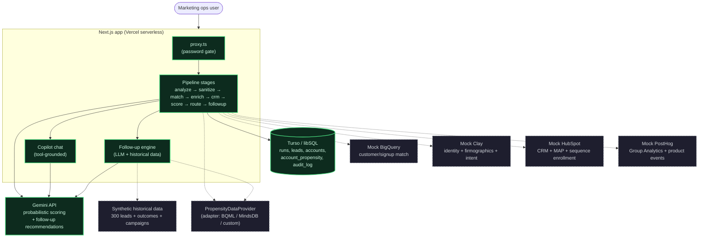

# RP Lead Pipeline — v3

A marketing-ops platform that ingests inbound lead CSVs, cleans and deduplicates them, matches
against internal systems, enriches with firmographic/intent/product-usage data, scores using
dual-engine MQL + PQL/AQL scoring, routes to the right treatment, and generates LLM-grounded
follow-up playbooks. v3 adds **account-centric PQL/AQL scoring** with PostHog product telemetry
and a **source-agnostic Propensity & Next Likely Purchase (NLP) engine** that enriches accounts
with predictive ML metrics from pluggable data providers.

## Architecture

Solid nodes/arrows are real, live integrations. Dashed nodes/arrows are simulated — in-process
mock modules that return realistic, deterministic payloads shaped like the real APIs, but never
make an external network call.



## What's real vs. simulated

- **Real**: the Next.js app, the ingestion/sanitize pipeline, the deterministic ICP scoring engine,
  Gemini calls for probabilistic scoring (6.2), the copilot (9.1), and the follow-up recommendation
  engine — all make real LLM API calls.
- **Simulated**: HubSpot, BigQuery, Clay, PostHog, and propensity data providers. Each has a mock
  module (`src/lib/mocks/*.ts` or `src/lib/propensity/providers/*.ts`) that returns realistic,
  deterministic payloads shaped like the real APIs, seeded from the input file so re-running the
  same CSV produces the same matches/scores every time.
- **v3 additions**: PostHog Group Analytics mock for product telemetry (compute hours, deployments,
  SSO signals, weekly growth), and a pluggable `PropensityDataProvider` adapter (reference
  implementation simulates Google BQML propensity toolkit outputs).

## Features

- **Full pipeline stepper**: analysis → sanitize → cohorts → enrichment → CRM/MAP → scoring →
  routing → follow-up → logs → review, each with its own page and live status tracking.
- **Account View**: dedicated accounts page with AQL status cards, expandable account cards
  showing team members, propensity badges, and drill-down to full account detail with PostHog
  telemetry and event timeline.
- **PQL/AQL dual scoring** *(v3)*: per-user Product-Qualified Lead (PQL) scores based on role +
  product events with time decay, and per-account Account-Qualified Lead (AQL) scores combining
  firmographic fit + product usage from PostHog telemetry.
- **Propensity & Next Likely Purchase engine** *(v3)*: source-agnostic `PropensityDataProvider`
  adapter enriches accounts with purchase propensity percentile, predicted expansion ACV, next
  likely product purchase, and key behavioral drivers. Reference provider simulates Google BQML
  toolkit outputs. External ML pipelines can POST propensity data via `/api/ingest/propensity`.
- **Enterprise routing** *(v3)*: AQL-qualified accounts get routed to enterprise sales; high-PQL
  users in nurture get upgraded to sales queue; propensity scores boost AQL by +15 for accounts
  in the 80th+ percentile.
- **Run All Stages**: one-click button that runs every remaining stage sequentially.
- **Lead detail drill-down**: click any lead ID to see its full record — identity, enrichment,
  campaign history, dual-engine score comparison, routing decision, and audit trail.
- **Sortable, filterable lead tables**: every stage page shows Email / Company / Title alongside
  stage-specific columns, with tier/status/decision filter chips and click-to-sort headers.
- **Live-updating UI**: the stepper, sidebar progress, and scorecard poll for updates automatically.
- **Follow-up recommendations**: for every lead routed to sales, nurture, or human review,
  Gemini generates 2-4 specific recommendations grounded in the lead's actual signals, historical
  data, and propensity predictions. Each recommendation can be executed in HubSpot with one click.
- **Copilot chat panel**: answers questions about leads, accounts, scores, propensity, and revenue
  potential using tool calls grounded in the current run's data. Includes `getHighPropensityAccounts`
  and `getRevenuePotentialSummary` tools.
- **Settings page**: adjust the score-divergence threshold and configure notifications.
- **Password gate**: the whole app sits behind a simple cookie-based password check (`src/proxy.ts`).

## Prerequisites

- Node.js 18+ and npm
- A Turso (libSQL) database — `TURSO_DATABASE_URL` and `TURSO_AUTH_TOKEN`
- A Gemini API key

Create `.env.local`:

```
GEMINI_API_KEY=...
TURSO_DATABASE_URL=...
TURSO_AUTH_TOKEN=...

# Optional
GEMINI_MODEL=gemini-flash-lite-latest
KIMI_API_KEY=...                       # Backup LLM (Moonshot AI)
KIMI_MODEL=moonshot-v1-32k
SCORE_DIVERGENCE_THRESHOLD=30
FOLLOWUP_BATCH_LIMIT=50
APP_PASSWORD=yourpassword
```

## Running locally

```bash
npm install
npm run dev
```

Open [http://localhost:3000](http://localhost:3000). If upgrading from an earlier version, run the migrations:

```bash
# v2 migration (adds followup columns)
TURSO_DATABASE_URL=... TURSO_AUTH_TOKEN=... npx tsx scripts/migrate.ts

# v3 migration (adds accounts table + PQL/AQL columns)
TURSO_DATABASE_URL=... TURSO_AUTH_TOKEN=... npx tsx scripts/migrate_v3.ts

# v3-propensity migration (adds account_propensity table)
TURSO_DATABASE_URL=... TURSO_AUTH_TOKEN=... npx tsx scripts/migrate_v3_propensity.ts
```

## Pipeline walkthrough

1. **Analysis** → review anomalies, add optional cleaning instructions, approve sanitize
2. **Sanitize** → review the diff, download the cleaned CSV, proceed to matching
3. **Cohorts** → simulated BigQuery signup match, split into existing/new user cohorts
4. **Enrichment** → simulated Clay identity resolution + firmographics + intent scoring +
   propensity data attachment (v3)
5. **CRM/MAP** → simulated HubSpot lookup, EU consent hard-rule enforcement (GDPR)
6. **Scoring** → deterministic ICP tier + Gemini probabilistic score + PQL/AQL scoring (v3) +
   propensity-based AQL boost (v3)
7. **Routing** → final routing decision with enterprise routing overrides (v3)
8. **Follow-up** → LLM generates personalised, executable follow-up recommendations grounded in
   historical data, account context, and propensity predictions (v3)
9. **Logs** → PII-free audit trail with drill-down to the full linked record

The **Accounts** view (linked from the stepper) shows all accounts with AQL status, propensity
badges, and expandable team member details. The **Review queue** is where a human approves or
rejects flagged leads. The **copilot** panel answers questions about leads, accounts, propensity,
and revenue potential.

## Tests

```bash
npm test
```

Unit tests cover:
- Deterministic ICP scoring engine (edge cases, competitor domains, tier classification)
- PQL scoring (target roles, time decay, event signals, score capping)
- AQL scoring (firmographic fit, PostHog usage, status thresholds)
- Propensity engine (deterministic generation, range validation, ACV rounding, graceful degradation,
  score boost logic, interface conformance)

## Data layout

- `src/lib/pipeline/` — analyze/sanitize logic (TypeScript), runs in-process
- `src/lib/stages/` — one module per pipeline stage (analyze, sanitize, match, enrich, crm, score,
  route, followup), each updating run/lead/account state and writing to the audit log
- `src/lib/mocks/` — HubSpot, BigQuery, Clay, PostHog mocks; historical synthetic dataset
- `src/lib/scoring/` — deterministic scorer, LLM scorer, reconciler, PQL/AQL scorers, config
- `src/lib/propensity/` — adapter pattern for propensity data:
  - `types.ts` — `PropensityDataProvider` interface and `AccountPropensityRecord` type
  - `providers/mock_google_bqml.ts` — reference mock simulating Google BQML outputs
- `src/lib/copilot/tools.ts` — copilot tool definitions (run summary, lead/account lookup,
  propensity queries, revenue potential)
- `src/lib/db.ts` — Turso/libSQL client
- `db/schema.sql` — checked-in DDL (idempotent `CREATE TABLE IF NOT EXISTS` everywhere)
- `scripts/migrate.ts` — v2 migration
- `scripts/migrate_v3.ts` — v3 migration (accounts table + PQL/AQL lead columns)
- `scripts/migrate_v3_propensity.ts` — v3-propensity migration (account_propensity table)

## Deployment

Deploys to Vercel. Full deployment instructions: see [USER_MANUAL.md](USER_MANUAL.md).

## Further reading

- [decisions.md](decisions.md) — Architecture and design decision log
- [writeup.md](writeup.md) — Full technical writeup of the pipeline
- [USER_MANUAL.md](USER_MANUAL.md) — Step-by-step guide for operators + deployment instructions
